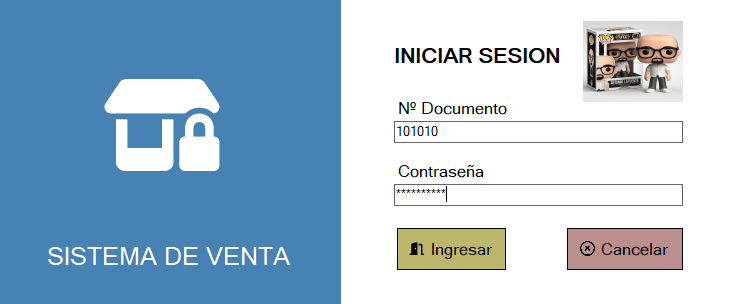

# SistemaVentas C#
#### Creación de una completa aplicación de escritorio de un sistema de ventas utilizando C# y SQL Server. Utilizando procecidientos almacenados reducimos de trafico de datos entre cliente y servidor, mejoramos la seguridad restringiendo el acceso a tablas y aumentamos la consistencia de las consultas mediante transacciones.

#### Mediante roles podemos restringir la visualización de determinados menús de la aplicación.
#### También podemos exportar tablas de compras, productos, etc mediante excel o exportar facturas o tickets de compra en formato PDF con el número de ticket/factura y el logo de nuestra empresa. Mediante un sencillo formulario el usuario puede importar el logo de su empresa y modificar los datos de la empresa mediante un formulario de WindowsForm sin tener que "picar" código. 
